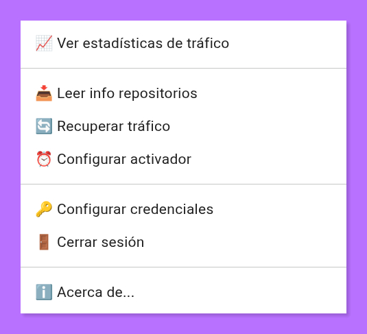
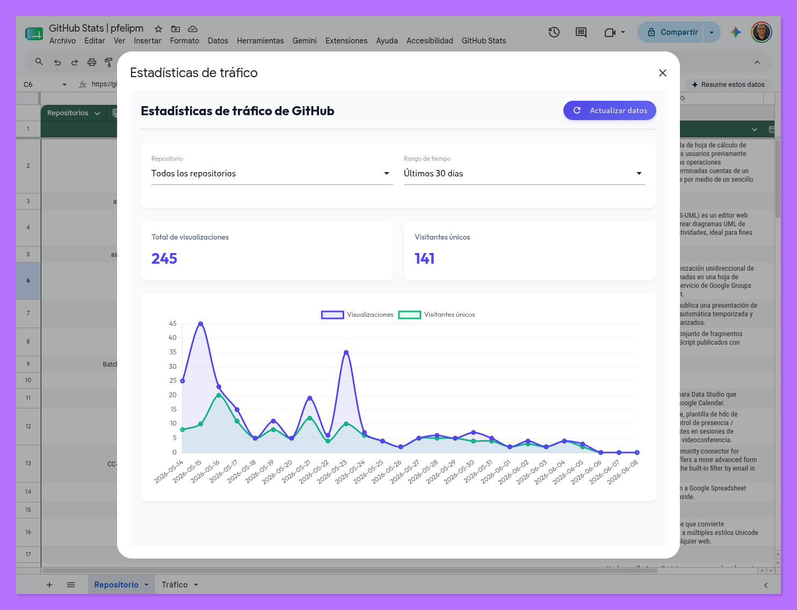
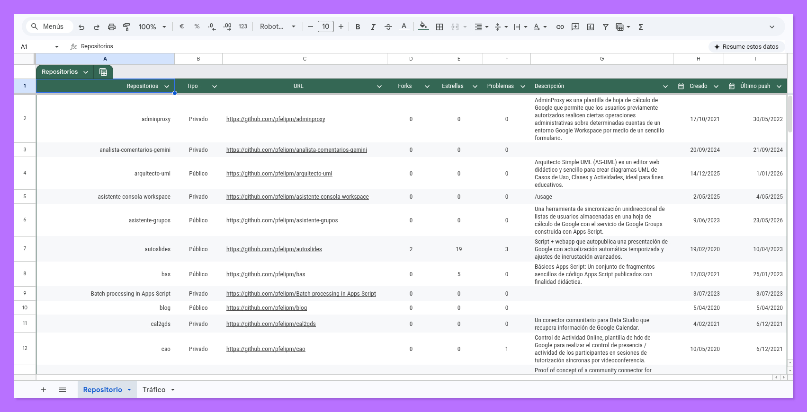
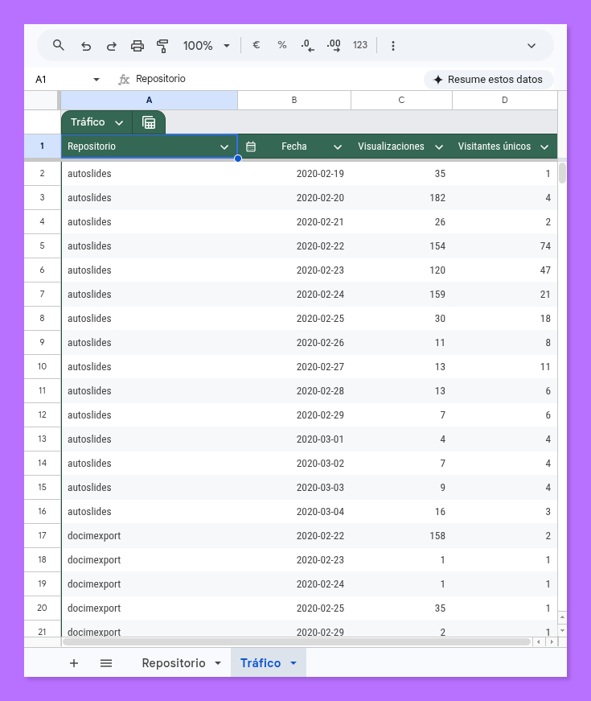
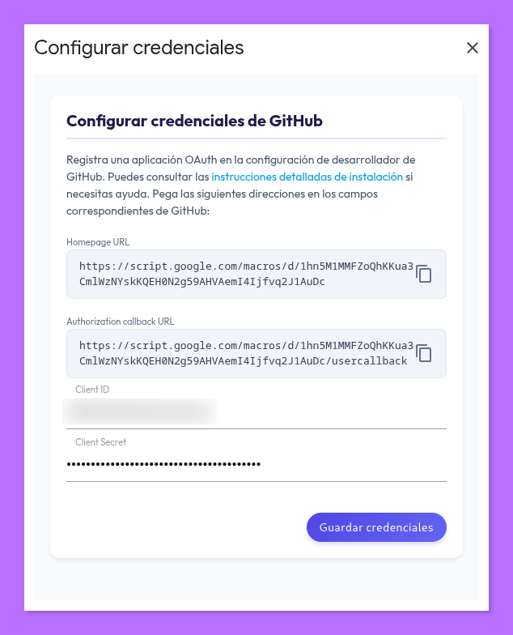
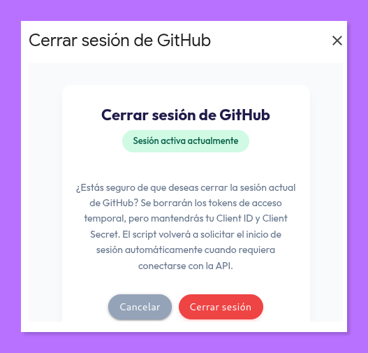
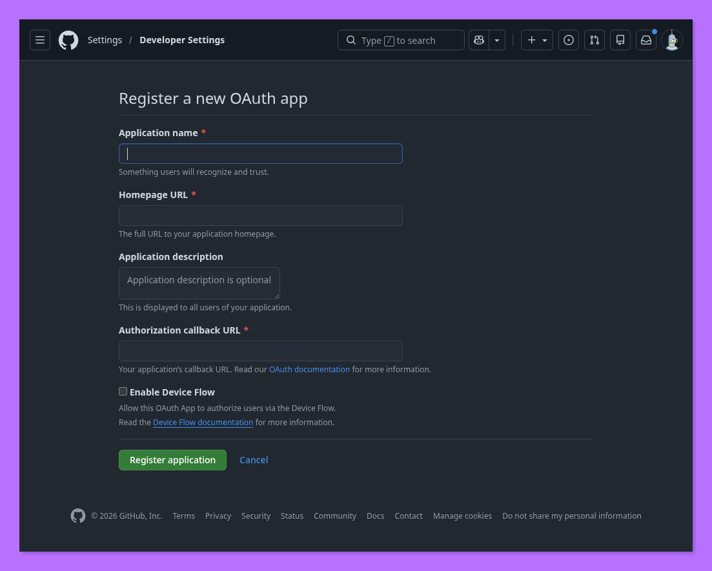

# GitHub Stats

  

  
  

Una herramienta moderna desarrollada en **Google Apps Script** para el análisis y la visualización de estadísticas y tráfico de tus repositorios de GitHub integrada directamente en tu hoja de cálculo, eliminando la dependencia de herramientas externas como Looker (Data) Studio.

> [!IMPORTANT]
> **Retención crítica de datos**: La API oficial de GitHub solo almacena y devuelve datos de tráfico correspondientes a los **últimos 14 días**. Si no realizas una copia histórica con una frecuencia menor a este periodo, esa información se perderá de manera permanente. Este script automatiza dicha recolección de datos históricos a través de un activador temporal programable.

  <a href="#características">Características</a> •
  <a href="#vista-de-la-aplicación">Vista de la aplicación</a> •
  <a href="#instalación-y-configuración">Instalación</a> •
  <a href="#instrucciones-de-uso">Instrucciones de uso</a> •
  <a href="#créditos">Créditos</a> •
  <a href="#licencia">Licencia</a>

## Características

- 📈 **Estadísticas de tráfico ricas e interactivas**: Gráficos dinámicos e interactivos de visitas y visitantes únicos a través de **Chart.js**. Permite filtrar individualmente por repositorio o de forma agregada, con rangos temporales flexibles (15, 30, 90, 180, 360 días o histórico completo).
- ⏰ **Planificación granular de activadores**: Configura ejecuciones automáticas de recuperación de tráfico recurrentes directamente desde la hoja de cálculo (por horas, por días, o seleccionando días de la semana y horas específicas).
- 🔑 **Configuración segura de credenciales**: Panel visual para introducir el `Client ID` y `Client Secret` guardándolos de forma segura en las propiedades internas del script, sin exponerlos en el código fuente.
- 📥 **Sincronización directa**: Obtiene detalles de tus repositorios públicos/privados y descarga de visitas empleando la API oficial de GitHub.
- 🚪 **Autenticación segura**: Integra el flujo OAuth2 de forma nativa para autorizar los permisos de lectura de la API de GitHub sobre tus repositorios.
- ℹ️ **Panel Acerca de**: Información del desarrollador, enlaces al código fuente original y soporte directo.

  

---

## Vista de la aplicación

### Menú contextual en la hoja de cálculo
El script añade de forma automática un menú para controlar todas las acciones y configuraciones organizadas en bloques.

  

### Panel de estadísticas interactivo
Permite analizar de forma agregada o individual el volumen de visualizaciones y visitas de los repositorios seleccionados en el rango temporal deseado.

  

### Hoja de datos de repositorios
Contiene la lista sincronizada de repositorios junto con metadatos útiles como descripción, lenguaje principal, fecha de creación y fecha del último push.

  

### Histórico acumulado de tráfico
Los datos se guardan secuencialmente y sin interrupciones en la pestaña de tráfico de la hoja de cálculo.

  

### Configurar credenciales OAuth
Acceso rápido y visual para configurar el inicio seguro y copiar los enlaces necesarios para registrar la aplicación.

  

### Diálogo Cerrar sesión
Modal interactivo que te permite ver el estado actual del acceso a GitHub y desconectar la cuenta si lo deseas de manera segura.

  

### Diálogo Acerca de...
Modal de créditos interactivo e integrado.

  

---

## Estructura del proyecto

- `Código.js`: Lógica principal del servidor de Google Apps Script, gestión de menús y obtención de datos de los repositorios y del histórico de tráfico.
- `Activador.js`: Control del ciclo de vida y configuración de los activadores basados en tiempo instalables de GAS.
- `Oauth.js`: Configuración del flujo de autenticación OAuth2 de GitHub.
- `Dashboard.html`: Interfaz del panel de análisis estadístico interactivo.
- `ActivadorUI.html`: Interfaz para la gestión y programación del activador por tiempo.
- `CredencialesUI.html`: Interfaz para la configuración y persistencia de las credenciales de la OAuth App.
- `CerrarSesionUI.html`: Interfaz para la confirmación e informe del estado del inicio de sesión.
- `acercaDe.html`: Cuadro de diálogo modal de créditos y atribución.

---

## Instalación y configuración

1. Realiza una copia de la **[plantilla de hoja de cálculo oficial](https://docs.google.com/spreadsheets/d/1NDaPRMx-o4ZBf2wtRjI3zwJwbdCySUpW-c2O6b-q18w/edit?usp=sharing)**.
2. Abre el editor de secuencias de comandos desde el menú **Extensiones > Apps Script**.
3. Recarga la hoja de cálculo para que aparezca el menú contextual **GitHub Stats**.
4. Ve a **GitHub Stats > 🔑 Configurar credenciales**.
5. Desde ese diálogo podrás ver directamente tu **Homepage URL** y tu **Authorization callback URL** (con opción de copiarlas rápidamente al portapapeles).
6. **Obtención y configuración de credenciales OAuth de GitHub**:
   Para permitir que el script se comunique de forma segura con la API de GitHub, necesitas registrar una aplicación OAuth propia:
   - Inicia sesión en GitHub y ve a **Settings (Configuración) > Developer Settings > OAuth Apps**.
   - Haz clic en **New OAuth App** (Nuevo registro de aplicación OAuth).
   - Rellena los datos básicos:
     - **Application name**: `GitHub Stats (o el nombre que prefieras)`.
     - **Homepage URL**: Pega la dirección de Homepage URL copiada en el paso 5.
     - **Authorization callback URL**: Pega la dirección de Authorization callback URL copiada en el paso 5.

   

     
   

   - Haz clic en **Register application**.
   - Copia el **Client ID** generado y pégalo en la ventana de configuración de la hoja de cálculo.
   - Haz clic en **Generate a new client secret**, copia el código generado y pégalo en el segundo campo de la ventana de configuración.
   - Haz clic en **Guardar credenciales** para salvar los datos de forma segura en las propiedades internas del script (evitando que queden expuestas en el código fuente).
7. Haz clic en cualquier comando de carga o configuración para iniciar el proceso de autorización OAuth y concede acceso a tus repositorios a través del nuevo diálogo HTML diseñado para ello.

---

## Instrucciones de uso

Una vez instalado y autenticado, podrás utilizar las herramientas del menú contextual `GitHub Stats`:

1. **📈 Ver estadísticas de tráfico**: Abre el panel visual e interactivo para consultar las visitas totales y visitantes únicos.
2. **📥 Leer info repositorios**: Fuerza la actualización alfabética y metadatos de tus repositorios en la pestaña `Repositorio`.
3. **🔄 Recuperar tráfico**: Ejecuta de forma manual la descarga del tráfico de visitas reciente.
4. **⏰ Configurar activador**: Establece la frecuencia automática con la que Google Apps Script recopilará los datos de tráfico (evitando perder la ventana de 15 días de la API de GitHub).
5. **🔑 Configurar credenciales**: Actualiza el Client ID y Client Secret de la aplicación autorizada.
6. **🚪 Cerrar sesión**: Desconecta la sesión actual de GitHub y limpia los tokens temporales de acceso de la hoja de cálculo de manera segura.

---

## Créditos

Desarrollado y mantenido por **Pablo Felip Monferrer** (pfelipm).

- Sitio web: [pablofelip.online/sobre-mi/](https://pablofelip.online/sobre-mi/)
- GitHub: [@pfelipm](https://github.com/pfelipm)
- LinkedIn: [pfelipm](https://www.linkedin.com/in/pfelipm/)
- X (Twitter): [@pfelipm](https://x.com/pfelipm)

---

## Licencia

Este proyecto está bajo la Licencia **GNU General Public License v3.0**. Para más información, consulta el archivo [LICENSE](LICENSE).